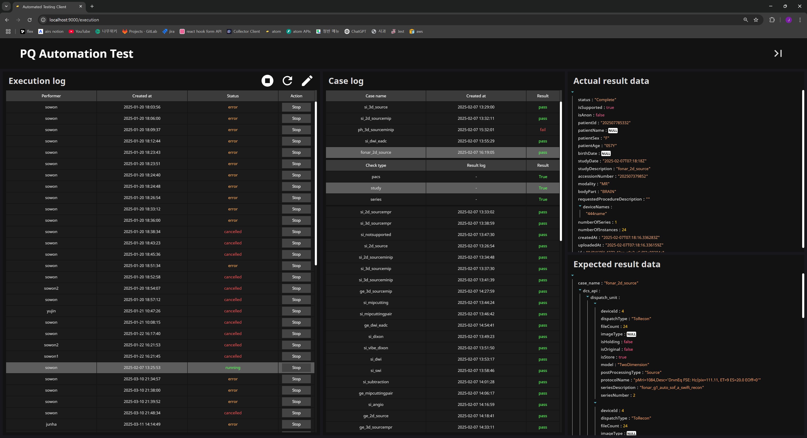
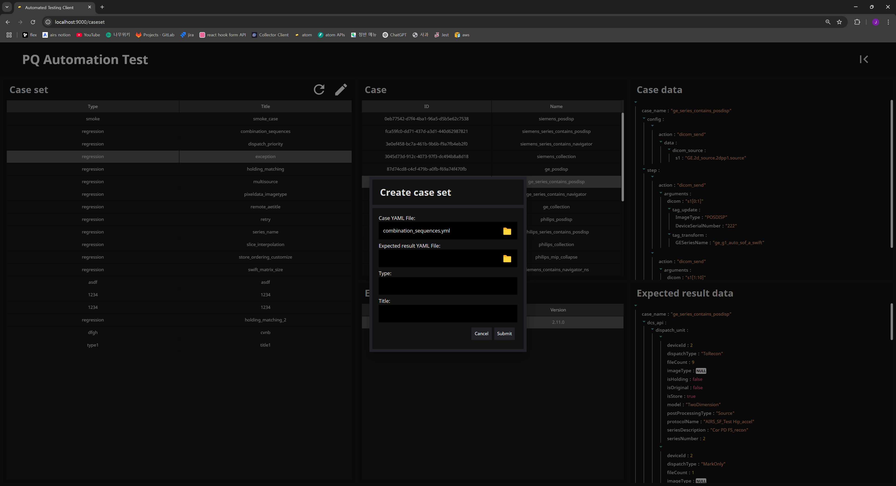

<h1 align="center">Automated testing client</h1>

[](./LICENSE)




## What is the Automated Testing Client?

- The Automated Testing Client (Atom Client) integrates a database and a user interface to manage and execute test cases.
- It streamlines the testing process by automatically sending multiple test cases (DICOM studies), verifying the results, and repeating the cycle.

## Version Compatibility

|    Name    | Version  |
| :--------: | :------: |
|  Node.js   | v23.5.0  |
|   React    | v18.2.0  |
|  Webpack   | v5.90.1  |
| Typescript |  v5.3.3  |
|    MUI     | v5.15.10 |

## Purpose

- Visualize test results through an intuitive UI.
- Store and manage results for each test case in a structured database.

## How to execute this app?

1. Download node modules.

   Yarn

   ```bash
    yarn
   ```

2. Create a `.env` file in your root directory and add the required environment variables:

   ```env

   ```

3. Run this App.
   ```bash
   yarn start
   ```

## How to test this app?

To run the test suite:

```bash
yarn test
```

## Directory Structure

    .
    ├── __mocks__               # automatically mocked modules
    ├── .husky                  # husky files
    ├── scripts                 # deploy scripts
    ├── src                     # Source files
    │   ├── assets              # image, font, type files
    │   ├── common              # api, axios configuration
    │   ├── components          # react components
    │   ├── containers          # react containers
    │   ├── recoil              # recoil variables, hooks
    │   ├── routes              # react route, pages
    │   ├── theme               # mui theme configuration
    │   ├── utils               # utility files
    │   └── index.tsx           # react root file
    ├── webpack                 # webpack config files
    ├── .dockerignore           # docker ignore file
    ├── .eslintrc.json          # eslint configuration
    ├── .gitignore              # git ignore file
    ├── .prettierrc.json        # prettier configuration
    ├── docker-compose.yml      # dcoker compose setting yaml
    ├── Dockerfile              # dockerfile for run this app through docker
    ├── jest.config.ts          # jest configuration file
    ├── jest.setup.ts           # jest setup file for configuring the test environment
    ├── LICENSE
    ├── nginx.conf              # nginx configuration
    ├── package-lock.json
    ├── package.json
    ├── README.md
    └── tsconfig.json           # ts configuration

## Tech Stack

- React
- TypeScript
- Recoil
- Material UI (MUI)
- Jest (for testing)
- Webpack
- Docker

<h2>How to upgrade all node modules?</h2>

<h3>Installation</h3>

```bash
    yarn add --global yarn-upgrade-all
```

<h3>Usage</h3>

1. Run yarn-upgrade-all command.

```bash
    yarn yarn-upgrade-all
```

<h3>Additional options</h3>

1. You may pass additional options to the <code>yarn add</code> command:

```bash
    yarn yarn-upgrade-all --option-1 --option-2
```
